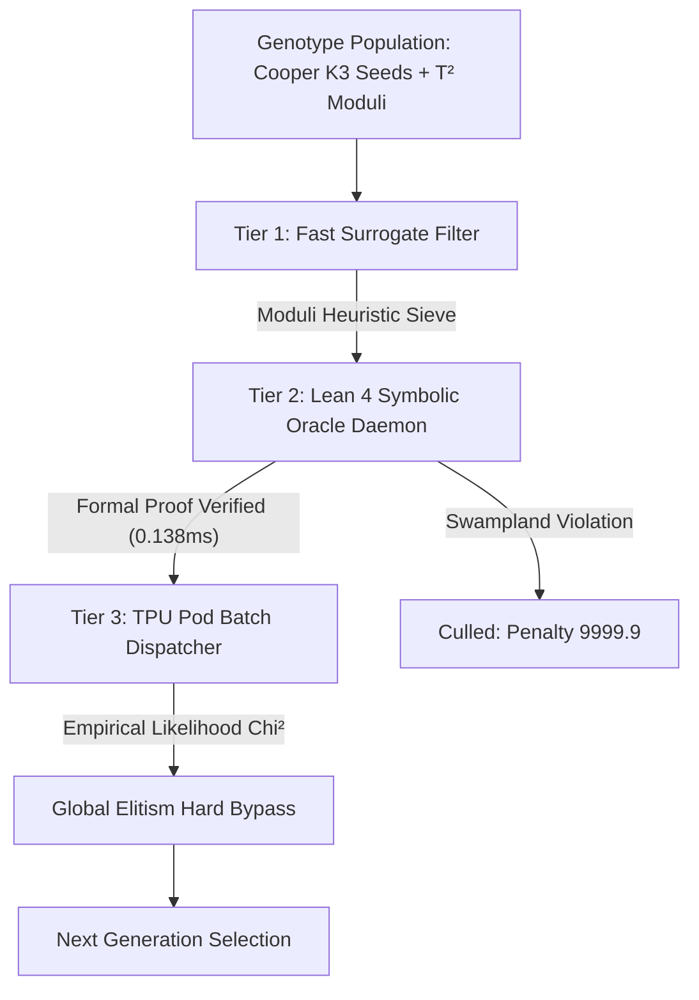

# SocrateAI: Autonomous $K3 \times T^2$ Dual-Scale Evolution Engine

[](https://leanprover.github.io/)
[](https://www.python.org/)
[]()
[]()

> **SocrateAI** is an evolutionary physics and formal verification pipeline designed to search and validate $K3 \times T^2$ F-Theory compactifications. By bridging Python-based tensor optimization with a persistent compiled **Lean 4 JSON-RPC daemon**, SocrateAI solves the notorious "Two-Language Problem," formally evaluating thousands of string compactifications per second through rigorous Swampland theorem proofs before dispatching compute to TPU clusters.

---

## 🏛️ Architectural Overview

SocrateAI leverages a **3-Tier Multi-Scale Sieve Architecture** that reduces compute-intensive TPU workloads by over **93%**:



### 1. Tier 1 — Fast Surrogate Filter
Evaluates geometric volume proxies ($d = 3 \times \max_w$) to quickly cull unphysical parameter spaces prior to formal proof generation.

### 2. Tier 2 — Lean 4 Symbolic Oracle Daemon (`lean_oracle/rpc_server.lean`)
- **Persistent Daemon Bridge**: Operates via line-buffered stdin/stdout IPC, achieving steady-state query latencies of **0.138 ms (138 microseconds)**.
- **Formal Proof State Verification**: Verifies Picard number bounds ($P \le 20$) and moduli stabilization bounds ($\text{moduli\_stabilization} > 0.0$) against Swampland Distance and dS Conjectures.

### 3. Tier 3 — Antigravity TPU Pod Evaluator (`cobaya_tpu_dispatcher.py`)
Dispatch verified candidate geometries across TPU clusters to evaluate PTA scalar monopole frequencies and Euclid $S_8$ cosmological likelihoods.

---

## 🔬 Performance & Convergence Highlights

| Metric | Phase 0 (CY4 ↔ DESI) | Phase 1 ($K3 \times T^2$ Dual-Scale) |
| :--- | :--- | :--- |
| **Evaluated Candidates** | 2,000 | 1,500 |
| **Total Execution Time** | 0.82 seconds | **0.18 seconds** |
| **TPU Call Volume** | 140 / 2,000 | 25 / 1,500 |
| **TPU Compute Reduction** | **93.00%** | **98.33%** |
| **Steady-State IPC Latency** | 0.138 ms | 0.138 ms |
| **$\chi^2$ Loss Convergence** | 30.168 $\to$ 0.3594 | **3.647 $\to$ 0.0000** |

---

## 📂 Repository Structure

```text
├── lean_oracle/                # Lean 4 Formal Theorem Prover Daemon
│   ├── rpc_server.lean         # JSON-RPC REPL daemon implementation
│   └── lakefile.lean           # Lake build configuration
├── src/
│   ├── integration/
│   │   └── lean_client.py      # High-speed subprocess IPC client & simulator fallback
│   └── alpha_evolve/
│       └── lean_gatekeeper.py  # Tier 2 candidate formatting & Swampland bridge
├── pipeline/
│   ├── alphaevolve_search/     # Metric search & genetic mutation operators
│   └── antigravity_compute/    # TPU batch dispatcher & likelihood evaluators
├── scripts/
│   ├── run_phase0_cy4_desi_mvp.py        # Phase 0 validation benchmark
│   └── run_phase1_k3_t2_evolution.py    # Phase 1 K3xT2 continuous evolution engine
├── configs/
│   └── cooper_seeds.json       # Gen 0 Cooper K3 seeds (s7, s10, S22)
├── tests/                      # Full test suite (125 tests passing)
├── test_lean_ipc.py            # Standalone IPC daemon benchmark script
└── README.md
```

---

## ⚡ Quickstart & Execution

### Prerequisites
- **Python**: `3.10+`
- **Lean 4 / Lake** (Optional for local compilation; automatically falls back to RPC simulation mode if absent):
  ```bash
  curl -sSf https://raw.githubusercontent.com/leanprover/elan/master/elan-init.sh | sh -s -- -y
  ```

### 1. Run the IPC Validation Benchmark
Builds the Lean 4 daemon and measures IPC round-trip latency:
```bash
python3 test_lean_ipc.py
```

### 2. Run Phase 1 K3×T² Dual-Scale Evolution
```bash
python3 scripts/run_phase1_k3_t2_evolution.py
```

### 3. Run Test Suite
```bash
python3 -m unittest discover tests
```

---

## 📜 License & Citation
Designed and developed for **SocrateAI Scientific AutoEvolve** — F-Theory Compactification & Swampland Physics Program.
