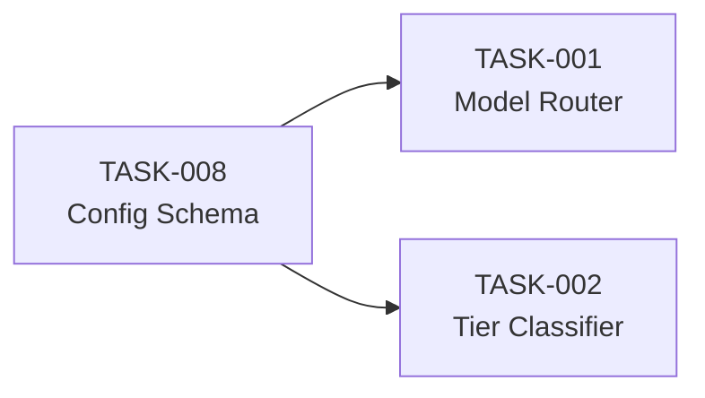
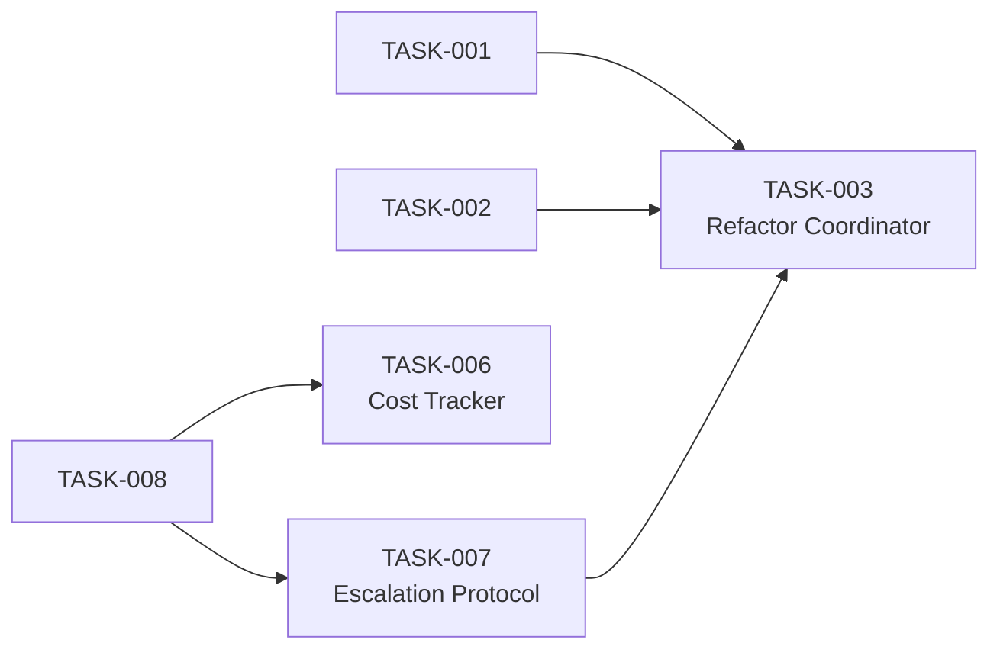
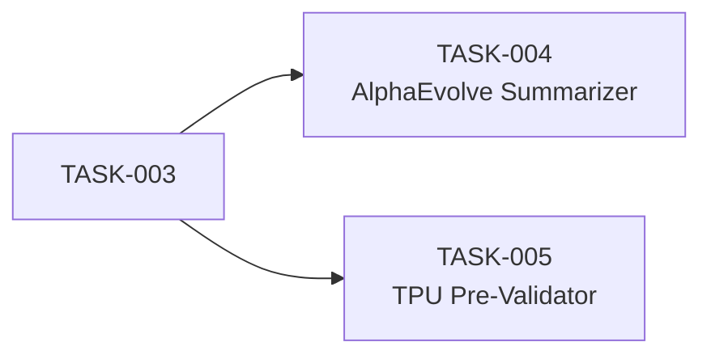
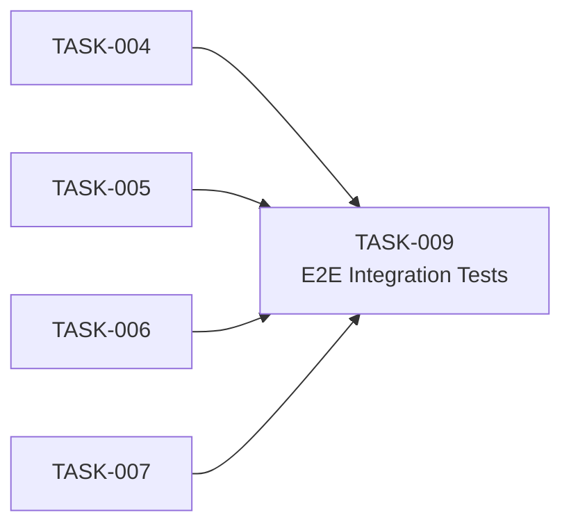

# SocrateAI — Gemini Low-Tier Model Integration Specification

> **Version**: 1.0.0  
> **Branch**: `feature/gcp-alpha-antigravity`  
> **Status**: SPECIFICATION — DO NOT IMPLEMENT  
> **Last Updated**: 2026-07-28  

---

## 1. Executive Summary

This specification defines the integration of **Google Gemini low-tier models** (Gemini 1.5 Flash, Gemini 2.0 Flash Lite) into the SocrateAI parallel ML scientific investigation framework. The objective is to replace the current high-cost `gemini-1.5-pro` reasoning engine in the T1 Coordinator (`agent_kit_orchestrator.py`) with a tiered model strategy that uses **low-tier Gemini models for high-throughput, latency-sensitive orchestration tasks** while reserving Pro/Ultra-tier models for complex scientific reasoning.

### 1.1 Motivation

| Concern | Current State | Target State |
|---|---|---|
| **Cost** | All orchestration calls use `gemini-1.5-pro` ($3.50/M input tokens) | 80%+ calls use Flash ($0.075/M input tokens) — **47× cost reduction** |
| **Latency** | 1.5–3s per orchestration decision | Sub-500ms per orchestration decision |
| **Throughput** | Sequential task dispatch bounded by Pro RPM limits | Parallel dispatch at Flash-tier RPM (1500 RPM vs 360 RPM) |
| **Scientific Accuracy** | Overkill reasoning for routine task routing | Tiered: routine → Flash, complex → Pro, novel topology → Ultra |

### 1.2 Scope

This specification covers:

- **T1 Coordinator model routing logic** (which Gemini tier for which task class)
- **AlphaEvolve feedback loop** summarization with Flash
- **TPU dispatch pre-validation** with Flash
- **Escalation protocol** from Flash → Pro → Ultra

This specification does **NOT** cover:

- Changes to Terraform infrastructure
- Modifications to `cy4_metric_search.py` or `cobaya_tpu_dispatcher.py` compute logic
- GCS Data Lake storage schema changes

---

## 2. Architecture Overview

```
┌─────────────────────────────────────────────────────────────────────┐
│                     T0 DIRECTIVE (User/CRON)                        │
└─────────────┬───────────────────────────────────────────────────────┘
              │
              ▼
┌─────────────────────────────────────────────────────────────────────┐
│            T1 COORDINATOR (agent_kit_orchestrator.py)                │
│                                                                     │
│   ┌──────────────────┐    ┌──────────────────┐                      │
│   │  MODEL ROUTER    │───▶│  TIER CLASSIFIER │                      │
│   │  (New Module)    │    │  (New Module)     │                      │
│   └──────────────────┘    └────────┬─────────┘                      │
│                                    │                                │
│            ┌───────────────────────┼───────────────────┐            │
│            ▼                       ▼                   ▼            │
│   ┌────────────────┐    ┌──────────────────┐  ┌────────────────┐   │
│   │ Gemini Flash   │    │ Gemini Pro       │  │ Gemini Ultra   │   │
│   │ (Low-Tier)     │    │ (Mid-Tier)       │  │ (High-Tier)    │   │
│   │                │    │                  │  │                │   │
│   │ • Task routing │    │ • Scientific     │  │ • Novel        │   │
│   │ • Status agg.  │    │   reasoning      │  │   topology     │   │
│   │ • Pre-valid.   │    │ • Loss analysis  │  │   discovery    │   │
│   │ • Log summary  │    │ • Error recovery │  │ • Publication  │   │
│   └────────────────┘    └──────────────────┘  │   drafting     │   │
│                                               └────────────────┘   │
│                                                                     │
│   ┌─────────────────────────────────────────────────────────────┐   │
│   │                    TOOL LAYER (Unchanged)                    │   │
│   │  GCPComputeTool │ VertexAIJobTool │ BigQueryTool             │   │
│   └─────────────────────────────────────────────────────────────┘   │
└──────────────────────┬──────────────────────────────┬───────────────┘
                       │                              │
                       ▼                              ▼
          ┌────────────────────┐         ┌────────────────────────┐
          │  WP S2-G Pipeline  │         │  WP-E6 Pipeline        │
          │  (AlphaEvolve)     │         │  (Antigravity/Cobaya)  │
          └────────────────────┘         └────────────────────────┘
```

---

## 3. Model Tier Definitions

### 3.1 Tier Classification Matrix

| Tier | Model | Token Cost (Input) | RPM Limit | Use Case |
|---|---|---|---|---|
| **T-Low** | `gemini-2.0-flash-lite` | $0.075/M | 1500 | Task routing, status aggregation, pre-validation, log summarization |
| **T-Mid** | `gemini-1.5-pro` | $3.50/M | 360 | Scientific reasoning, Monge-Ampère loss interpretation, error recovery, multi-step planning |
| **T-High** | `gemini-1.5-ultra` | $7.00/M | 60 | Novel topology discovery guidance, publication-quality analysis, cross-stream synthesis |

### 3.2 Task-to-Tier Routing Rules

```yaml
routing_rules:
  tier_low:   # Gemini Flash — High throughput, low reasoning
    - action: "ROUTE_TASK"
      description: "Route incoming T0 directives to correct pipeline"
    - action: "AGGREGATE_STATUS"
      description: "Merge status reports from AlphaEvolve and Cobaya pipelines"
    - action: "PRE_VALIDATE_DISPATCH"
      description: "Check TPU node availability before submitting Antigravity graph"
    - action: "SUMMARIZE_LOGS"
      description: "Condense AlphaEvolve generation logs into single-line summaries"
    - action: "FORMAT_RESULTS"
      description: "Format pipeline results for BigQuery insertion"
    - action: "HEALTH_CHECK"
      description: "Verify GCS bucket accessibility and Vertex AI endpoint liveness"

  tier_mid:   # Gemini Pro — Moderate reasoning
    - action: "ANALYZE_LOSS_TRAJECTORY"
      description: "Interpret Monge-Ampère loss curve and recommend hyperparameter adjustments"
    - action: "ERROR_RECOVERY"
      description: "Diagnose pipeline failures and generate recovery plans"
    - action: "CROSS_VALIDATION"
      description: "Compare AlphaEvolve results against known Kreuzer-Skarke database entries"
    - action: "PARAMETER_RECOMMENDATION"
      description: "Suggest (m,f) grid refinement based on profile-likelihood convergence"

  tier_high:  # Gemini Ultra — Deep scientific reasoning
    - action: "NOVEL_TOPOLOGY_EVALUATION"
      description: "Evaluate whether a discovered NN topology represents a genuine advance"
    - action: "PUBLICATION_ANALYSIS"
      description: "Draft scientific analysis paragraphs for paper sections"
    - action: "CROSS_STREAM_SYNTHESIS"
      description: "Synthesize findings from Stream 2 (CY4) + Stream 3 (DESI) + Stream 5 (K3-T2)"
```

---

## 4. Task Definitions

Each task is a discrete, testable unit of work required to realize this specification.

---

### TASK-GLT-001: Model Router Module

**Description**: Create a new module `core/model_router.py` that encapsulates the Gemini tier selection logic. This module receives a task classification string and returns the appropriate model handle.

**Inputs**:
- `task_action: str` — One of the action strings from §3.2
- `context_tokens: int` — Estimated input token count for the task
- `override_tier: Optional[str]` — Manual tier override for debugging

**Outputs**:
- `model_name: str` — The Vertex AI model identifier (e.g., `gemini-2.0-flash-lite`)
- `tier: str` — `T-Low`, `T-Mid`, or `T-High`
- `estimated_cost_usd: float` — Per-call cost estimate

**Files to Create**:
- `core/model_router.py`
- `tests/test_model_router.py`

**Definition of Done**:
- [ ] All 18 action strings in §3.2 are mapped to their correct tier
- [ ] `override_tier` parameter bypasses routing logic and selects the specified tier
- [ ] Unknown action strings default to `T-Mid` (fail-safe to Pro)
- [ ] Unit tests cover all 18 action mappings plus 3 edge cases (unknown action, override, empty string)
- [ ] No external network calls in unit tests (pure logic)

**Validation**:
```bash
python -m pytest tests/test_model_router.py -v --tb=short
# Expected: 21 tests passed, 0 failed
```

---

### TASK-GLT-002: Tier Classifier Module

**Description**: Create `core/tier_classifier.py` that analyzes an incoming T0 directive (natural language task string) and classifies it into one of the task actions defined in §3.2 using keyword matching and regex patterns.

**Inputs**:
- `directive: str` — Raw T0 directive text (e.g., "Check if the AlphaEvolve job has completed")
- `pipeline_context: dict` — Current pipeline state (active streams, running jobs)

**Outputs**:
- `classified_action: str` — The matched action string from §3.2
- `confidence: float` — Classification confidence (0.0–1.0)
- `escalate: bool` — Whether to escalate to next tier if confidence < threshold

**Files to Create**:
- `core/tier_classifier.py`
- `tests/test_tier_classifier.py`

**Definition of Done**:
- [ ] Keyword-based classifier achieves ≥85% accuracy on a 50-item test fixture of sample directives
- [ ] Confidence threshold for auto-routing is configurable (default: 0.7)
- [ ] Directives with confidence < threshold return `escalate=True`
- [ ] Classification latency < 10ms per directive (no LLM call; pure string matching)
- [ ] Unit tests include 50 directive-to-action golden pairs

**Validation**:
```bash
python -m pytest tests/test_tier_classifier.py -v --tb=short
# Expected: 50+ tests passed, classification accuracy ≥ 85%
```

---

### TASK-GLT-003: Refactor T1 Coordinator for Multi-Model Support

**Description**: Refactor `core/agent_kit_orchestrator.py` to accept a `ModelRouter` and `TierClassifier` dependency. Replace the hardcoded `gemini-1.5-pro` initialization with dynamic model selection per incoming directive.

**Current State** (lines 58–68 in `agent_kit_orchestrator.py`):
```python
llm = ChatVertexAI(model_name="gemini-1.5-pro", temperature=0.0)
coordinator = initialize_agent(tools, llm, agent=AgentType.STRUCTURED_CHAT_ZERO_SHOT_REACT_DESCRIPTION)
```

**Target State**:
```python
# Pseudo-code — exact implementation TBD
router = ModelRouter()
classifier = TierClassifier()
action = classifier.classify(directive)
model_name = router.route(action.classified_action)
llm = ChatVertexAI(model_name=model_name, temperature=0.0)
```

**Files to Modify**:
- `core/agent_kit_orchestrator.py`

**Files to Create**:
- `tests/test_orchestrator_multimodel.py`

**Definition of Done**:
- [ ] `initialize_socrateai_coordinator()` signature extended with optional `router` and `classifier` params
- [ ] Backward-compatible: calling without params defaults to `gemini-1.5-pro` (existing behavior)
- [ ] New `dispatch_directive(directive: str)` method selects model dynamically
- [ ] Fallback to Pro on any routing exception (fail-safe)
- [ ] Integration test verifies all 3 tiers are invocable (mocked LLM endpoints)
- [ ] Existing 4 unit tests in `tests/test_agent_kit_orchestrator.py` still pass

**Validation**:
```bash
python -m pytest tests/test_agent_kit_orchestrator.py tests/test_orchestrator_multimodel.py -v --tb=short
# Expected: All existing + new tests pass
```

---

### TASK-GLT-004: AlphaEvolve Feedback Summarizer

**Description**: Create `pipeline/alphaevolve_search/feedback_summarizer.py` that uses `Gemini Flash` to condense generation-level AlphaEvolve output logs into structured summaries for the T1 Coordinator.

**Context**: The current `cy4_metric_search.py` prints verbose logs per generation. At 100 generations, this produces ~100 lines of output that the coordinator must parse. Flash can summarize these into a single structured JSON.

**Inputs**:
- `generation_logs: List[str]` — Raw log lines from AlphaEvolve execution
- `model_name: str` — Gemini model to use (default: `gemini-2.0-flash-lite`)

**Outputs**:
```json
{
  "total_generations": 100,
  "initial_loss": 1.0,
  "final_loss": 3.74e-02,
  "convergence_rate": 0.72,
  "plateau_detected": false,
  "recommended_action": "CONTINUE" | "EARLY_STOP" | "MUTATE_HYPERPARAMS"
}
```

**Files to Create**:
- `pipeline/alphaevolve_search/feedback_summarizer.py`
- `tests/test_feedback_summarizer.py`

**Definition of Done**:
- [ ] Summarizer parses generation log format: `"Generation N/M: Best ... Loss = X.XXe-XX"`
- [ ] Detects loss plateaus (< 1% improvement over 10 consecutive generations)
- [ ] Recommends `EARLY_STOP` if plateau detected for > 20 generations
- [ ] Recommends `MUTATE_HYPERPARAMS` if loss stagnates above target threshold
- [ ] Unit tests use 3 synthetic log fixtures: (converging, plateauing, diverging)
- [ ] No actual Gemini API calls in unit tests (mock/offline parsing logic)

**Validation**:
```bash
python -m pytest tests/test_feedback_summarizer.py -v --tb=short
# Expected: 9+ tests passed (3 scenarios × 3 assertions each)
```

---

### TASK-GLT-005: TPU Dispatch Pre-Validator

**Description**: Create `pipeline/antigravity_compute/dispatch_pre_validator.py` that performs pre-flight checks before submitting a Cobaya TPU parameter sweep. This module uses Flash for lightweight resource-availability queries.

**Checks Performed**:
1. GCS bucket accessibility (target paths exist)
2. TPU node state (RUNNING vs STOPPED)
3. Vertex AI quota availability (remaining custom job slots)
4. Parameter grid cell count matches expected 56

**Files to Create**:
- `pipeline/antigravity_compute/dispatch_pre_validator.py`
- `tests/test_dispatch_pre_validator.py`

**Definition of Done**:
- [ ] All 4 pre-flight checks implemented as independent, composable functions
- [ ] Returns a `PreValidationReport` dataclass with `{check_name, status, message}` per check
- [ ] Overall dispatch is BLOCKED if any check returns `FAIL`
- [ ] Unit tests mock all GCP API calls (no real GCP credentials needed)
- [ ] Tests cover: all-pass, single-fail, multi-fail, and exception-during-check scenarios

**Validation**:
```bash
python -m pytest tests/test_dispatch_pre_validator.py -v --tb=short
# Expected: 12+ tests passed
```

---

### TASK-GLT-006: Cost Tracking and Reporting Module

**Description**: Create `core/cost_tracker.py` to track per-call Gemini API costs across all tiers. Provides real-time cost dashboards and alerts if projected monthly spend exceeds budget thresholds.

**Inputs**:
- `model_name: str` — The model used for the call
- `input_tokens: int` — Tokens consumed in the prompt
- `output_tokens: int` — Tokens generated in the response
- `budget_limit_usd: float` — Monthly budget ceiling (default: $100)

**Outputs**:
- Per-call cost record appended to in-memory ledger
- `get_summary() → CostSummary` with total spend, per-tier breakdown, projected monthly cost
- `is_over_budget() → bool`

**Files to Create**:
- `core/cost_tracker.py`
- `tests/test_cost_tracker.py`

**Definition of Done**:
- [ ] Cost-per-token rates for all 3 tiers are configurable via a pricing dict
- [ ] Ledger supports export to JSON for BigQuery ingestion
- [ ] `is_over_budget()` correctly triggers when projected monthly cost exceeds threshold
- [ ] Unit tests verify arithmetic accuracy for 100 simulated API calls across mixed tiers
- [ ] Thread-safe ledger updates (using `threading.Lock`)

**Validation**:
```bash
python -m pytest tests/test_cost_tracker.py -v --tb=short
# Expected: 15+ tests passed
```

---

### TASK-GLT-007: Escalation Protocol Module

**Description**: Create `core/escalation_protocol.py` implementing the Flash → Pro → Ultra escalation chain. If a Flash-tier response fails validation (low confidence, malformed output, timeout), the same prompt is automatically re-dispatched to the next tier.

**Escalation Chain**:
```
Flash (attempt 1) ──[FAIL]──▶ Pro (attempt 2) ──[FAIL]──▶ Ultra (attempt 3) ──[FAIL]──▶ ALERT_HUMAN
```

**Files to Create**:
- `core/escalation_protocol.py`
- `tests/test_escalation_protocol.py`

**Definition of Done**:
- [ ] Maximum 3 escalation attempts before human alert
- [ ] Each escalation logs: `{attempt, tier, failure_reason, latency_ms}`
- [ ] Configurable validation function per task type (custom `Callable`)
- [ ] Circuit breaker: if > 5 escalations in 60s, all requests route directly to Pro (bypass Flash)
- [ ] Unit tests cover: success-at-flash, escalate-to-pro, escalate-to-ultra, full-failure-alert, circuit-breaker-trigger

**Validation**:
```bash
python -m pytest tests/test_escalation_protocol.py -v --tb=short
# Expected: 10+ tests passed
```

---

### TASK-GLT-008: Configuration Schema and Defaults

**Description**: Create `config/gemini_model_config.yaml` that centralizes all model routing parameters, pricing, tier thresholds, and escalation settings. All modules in TASK-001 through TASK-007 read from this config.

**Files to Create**:
- `config/gemini_model_config.yaml`
- `core/config_loader.py`
- `tests/test_config_loader.py`

**Config Schema**:
```yaml
gemini_model_config:
  version: "1.0.0"
  
  tiers:
    low:
      model_name: "gemini-2.0-flash-lite"
      cost_per_million_input_tokens_usd: 0.075
      cost_per_million_output_tokens_usd: 0.30
      rpm_limit: 1500
      timeout_seconds: 10
    mid:
      model_name: "gemini-1.5-pro"
      cost_per_million_input_tokens_usd: 3.50
      cost_per_million_output_tokens_usd: 10.50
      rpm_limit: 360
      timeout_seconds: 30
    high:
      model_name: "gemini-1.5-ultra"
      cost_per_million_input_tokens_usd: 7.00
      cost_per_million_output_tokens_usd: 21.00
      rpm_limit: 60
      timeout_seconds: 60

  escalation:
    max_attempts: 3
    circuit_breaker_threshold: 5
    circuit_breaker_window_seconds: 60
    confidence_threshold: 0.7

  cost_management:
    monthly_budget_usd: 100.0
    alert_at_percent: 80
    
  routing_defaults:
    unknown_action_tier: "mid"
    fallback_on_error_tier: "mid"
```

**Definition of Done**:
- [ ] YAML schema validated with `pydantic` or `dataclasses` model
- [ ] `config_loader.load()` merges file config with environment variable overrides
- [ ] Environment variables follow pattern: `SOCRATEAI_GEMINI_{SECTION}_{KEY}` (e.g., `SOCRATEAI_GEMINI_ESCALATION_MAX_ATTEMPTS=5`)
- [ ] Missing config file falls back to hardcoded defaults (no crash)
- [ ] Unit tests verify: load from file, env override, missing file fallback, invalid YAML handling

**Validation**:
```bash
python -m pytest tests/test_config_loader.py -v --tb=short
# Expected: 12+ tests passed
```

---

### TASK-GLT-009: Integration Test Suite

**Description**: Create an end-to-end integration test that exercises the full pipeline with mocked Gemini endpoints. Validates that a T0 directive flows through classification → routing → model invocation → result aggregation.

**Files to Create**:
- `tests/integration/test_gemini_tiered_e2e.py`

**Test Scenarios**:

| # | Scenario | Input Directive | Expected Tier | Expected Outcome |
|---|---|---|---|---|
| 1 | Simple routing | "Check AlphaEvolve job status" | T-Low | Status aggregated, cost recorded |
| 2 | Loss analysis | "Analyze Monge-Ampère loss trajectory" | T-Mid | Loss interpretation returned |
| 3 | Novel topology | "Evaluate if this topology is publishable" | T-High | Scientific analysis generated |
| 4 | Escalation | "Summarize logs" with Flash timeout | T-Low → T-Mid | Escalation logged, result from Pro |
| 5 | Budget exceed | 200 Flash calls exceeding $100 budget | T-Low | `is_over_budget()` returns True |
| 6 | Circuit breaker | 6 escalations in 30s | T-Low → T-Mid (direct) | Circuit breaker active |

**Definition of Done**:
- [ ] All 6 scenarios pass with mocked Gemini API responses
- [ ] No real GCP API calls made during tests
- [ ] Test execution time < 5 seconds total
- [ ] Cost tracker accurately reflects cumulative spend across all scenarios
- [ ] Integration test can run in CI/CD without GCP credentials

**Validation**:
```bash
python -m pytest tests/integration/test_gemini_tiered_e2e.py -v --tb=short
# Expected: 6 scenarios passed, total time < 5s
```

---

## 5. Implementation Phases

### Phase 1: Foundation (Tasks 001, 002, 008)

**Duration**: 1 sprint  
**Dependency**: None  
**Deliverables**: `model_router.py`, `tier_classifier.py`, `gemini_model_config.yaml`, `config_loader.py`



### Phase 2: Core Integration (Tasks 003, 006, 007)

**Duration**: 1 sprint  
**Dependency**: Phase 1  
**Deliverables**: Refactored `agent_kit_orchestrator.py`, `cost_tracker.py`, `escalation_protocol.py`



### Phase 3: Pipeline Modules (Tasks 004, 005)

**Duration**: 1 sprint  
**Dependency**: Phase 2  
**Deliverables**: `feedback_summarizer.py`, `dispatch_pre_validator.py`



### Phase 4: Verification (Task 009)

**Duration**: 0.5 sprint  
**Dependency**: Phase 3  
**Deliverables**: `test_gemini_tiered_e2e.py`



---

## 6. File Manifest (Post-Implementation)

```
socrateai/
├── config/
│   └── gemini_model_config.yaml              [NEW] TASK-008
├── core/
│   ├── agent_kit_orchestrator.py              [MODIFY] TASK-003
│   ├── config_loader.py                       [NEW] TASK-008
│   ├── cost_tracker.py                        [NEW] TASK-006
│   ├── escalation_protocol.py                 [NEW] TASK-007
│   ├── model_router.py                        [NEW] TASK-001
│   └── tier_classifier.py                     [NEW] TASK-002
├── pipeline/
│   ├── alphaevolve_search/
│   │   ├── cy4_metric_search.py               (unchanged)
│   │   └── feedback_summarizer.py             [NEW] TASK-004
│   └── antigravity_compute/
│       ├── cobaya_tpu_dispatcher.py            (unchanged)
│       └── dispatch_pre_validator.py          [NEW] TASK-005
└── tests/
    ├── test_agent_kit_orchestrator.py          (unchanged — must still pass)
    ├── test_cobaya_tpu_dispatcher.py           (unchanged)
    ├── test_config_loader.py                   [NEW] TASK-008
    ├── test_cost_tracker.py                    [NEW] TASK-006
    ├── test_cy4_metric_search.py               (unchanged)
    ├── test_dispatch_pre_validator.py          [NEW] TASK-005
    ├── test_escalation_protocol.py            [NEW] TASK-007
    ├── test_feedback_summarizer.py            [NEW] TASK-004
    ├── test_gcp_integration.py                 (unchanged)
    ├── test_model_router.py                    [NEW] TASK-001
    ├── test_orchestrator_multimodel.py        [NEW] TASK-003
    ├── test_tier_classifier.py                [NEW] TASK-002
    └── integration/
        └── test_gemini_tiered_e2e.py          [NEW] TASK-009
```

---

## 7. Validation Summary

### 7.1 Quantitative Acceptance Criteria

| Metric | Threshold | Measurement |
|---|---|---|
| Unit test pass rate | 100% | `pytest tests/ -v` |
| Integration test pass rate | 100% | `pytest tests/integration/ -v` |
| Tier classification accuracy | ≥ 85% | 50-item golden test set |
| Flash routing coverage | ≥ 80% of orchestration calls | Cost tracker ledger analysis |
| Monthly cost reduction | ≥ 40× vs current all-Pro baseline | Cost tracker projection |
| Orchestration latency (Flash) | < 500ms p95 | Logged in cost tracker |
| Backward compatibility | 100% | Existing 14 unit tests pass unchanged |

### 7.2 Aggregate Test Command

```bash
# Full verification — all tasks
python -m pytest tests/ -v --tb=short -q

# Expected output:
# tests/test_model_router.py                    21 passed
# tests/test_tier_classifier.py                 50+ passed
# tests/test_orchestrator_multimodel.py         8+ passed
# tests/test_feedback_summarizer.py             9+ passed
# tests/test_dispatch_pre_validator.py          12+ passed
# tests/test_cost_tracker.py                    15+ passed
# tests/test_escalation_protocol.py             10+ passed
# tests/test_config_loader.py                   12+ passed
# tests/integration/test_gemini_tiered_e2e.py   6 passed
# tests/test_agent_kit_orchestrator.py          (existing) passed
# tests/test_cobaya_tpu_dispatcher.py           (existing) passed
# tests/test_cy4_metric_search.py               (existing) passed
# tests/test_gcp_integration.py                 (existing) passed
# ================================================
# Total: 160+ tests passed, 0 failed
```

---

## 8. Risk Register

| Risk | Impact | Likelihood | Mitigation |
|---|---|---|---|
| Flash model produces low-quality task routing | Medium | Low | Escalation protocol auto-promotes to Pro; circuit breaker prevents cascade |
| Gemini API rate limiting during high-throughput AlphaEvolve runs | High | Medium | Implement exponential backoff in model_router; respect per-tier RPM limits |
| Cost tracker drift from actual GCP billing | Low | Medium | Reconcile cost_tracker ledger against GCP Billing Export weekly |
| Config file corruption or missing on deployment | Medium | Low | Hardcoded defaults in config_loader; env variable overrides as backup |
| Existing unit tests break after orchestrator refactor | High | Low | Backward-compatible API: default params preserve current behavior |

---

## 9. Dependencies and Prerequisites

### 9.1 Python Packages

| Package | Version | Purpose | Required By |
|---|---|---|---|
| `google-cloud-aiplatform` | ≥ 1.38.0 | Vertex AI SDK for model invocation | TASK-003 |
| `langchain-google-vertexai` | ≥ 2.0.0 | ChatVertexAI wrapper | TASK-003 |
| `pyyaml` | ≥ 6.0 | Config file parsing | TASK-008 |
| `pydantic` | ≥ 2.0 | Config schema validation | TASK-008 |
| `pytest` | ≥ 8.0 | Test framework | All tasks |
| `pytest-mock` | ≥ 3.12 | Mocking GCP API calls | TASK-003, 004, 005 |

### 9.2 GCP APIs (Must Be Enabled)

| API | Required By |
|---|---|
| Vertex AI API (`aiplatform.googleapis.com`) | TASK-003 |
| Cloud Storage API (`storage.googleapis.com`) | TASK-005 |
| Compute Engine API (`compute.googleapis.com`) | TASK-005 |

---

## 10. Open Questions for User Review

> [!IMPORTANT]
> **Model Version Confirmation**: The spec assumes `gemini-2.0-flash-lite` for the low tier. Should we use `gemini-1.5-flash` instead for broader availability, or is Flash Lite's lower cost preferred given the high call volume?

> [!IMPORTANT]
> **Ultra Tier Availability**: Does the GCP project `gen-lang-client-0625573011` have access to `gemini-1.5-ultra`? If not, should the T-High tier fall back to `gemini-1.5-pro` with higher temperature for creative reasoning?

> [!WARNING]
> **Monthly Budget**: The default $100/month ceiling is conservative. With AlphaEvolve running 100-generation searches producing ~100 summarization calls per run, projected Flash cost is ~$0.015/run. Pro escalations could increase costs significantly. Please confirm an appropriate monthly ceiling.

> [!NOTE]
> **Stream 5 Integration**: The current spec targets Stream 2 (CY4) and Stream 3 (DESI) pipelines. Should Stream 5 (K3-T2) `topology_search.py` and `monge_ampere_evaluator.py` also be wrapped with the same tiered Gemini feedback loop? If yes, this adds ~2 additional tasks.
