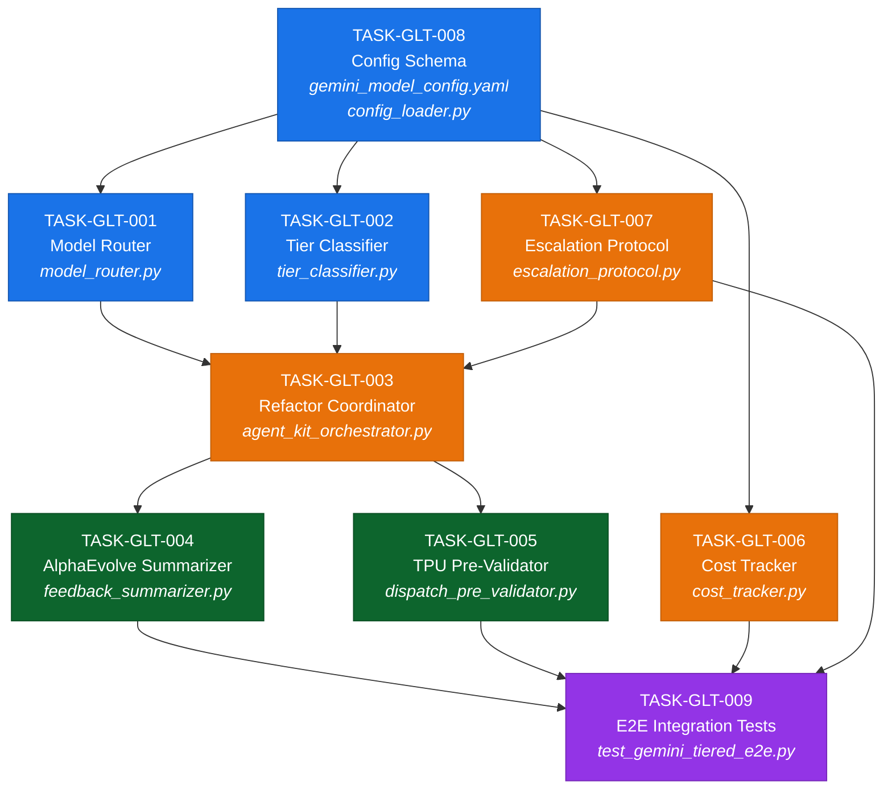

# Gemini Low-Tier Model — Task Dependency & Validation Index

> Quick-reference companion to [`gemini_low_tier_plan.md`](file:///home/xavkal/.gemini/antigravity-ide/scratch/socrateai/specs/gemini_low_tier_plan.md)

---

## Task Dependency Graph

**Legend**: 🔵 Phase 1 (Foundation) · 🟠 Phase 2 (Core Integration) · 🟢 Phase 3 (Pipeline) · 🟣 Phase 4 (Verification)

---

## Validation Checklist

| Task ID | Module | Min Tests | Test Command | DoD Items |
|---|---|---|---|---|
| GLT-001 | `core/model_router.py` | 21 | `pytest tests/test_model_router.py` | 5 |
| GLT-002 | `core/tier_classifier.py` | 50 | `pytest tests/test_tier_classifier.py` | 5 |
| GLT-003 | `core/agent_kit_orchestrator.py` | 8 | `pytest tests/test_orchestrator_multimodel.py` | 6 |
| GLT-004 | `pipeline/.../feedback_summarizer.py` | 9 | `pytest tests/test_feedback_summarizer.py` | 6 |
| GLT-005 | `pipeline/.../dispatch_pre_validator.py` | 12 | `pytest tests/test_dispatch_pre_validator.py` | 5 |
| GLT-006 | `core/cost_tracker.py` | 15 | `pytest tests/test_cost_tracker.py` | 5 |
| GLT-007 | `core/escalation_protocol.py` | 10 | `pytest tests/test_escalation_protocol.py` | 5 |
| GLT-008 | `config/gemini_model_config.yaml` | 12 | `pytest tests/test_config_loader.py` | 5 |
| GLT-009 | `tests/integration/` | 6 | `pytest tests/integration/` | 5 |
| **TOTAL** | | **143+** | `pytest tests/ -v` | **47** |

---

## Cost Projection Model

| Scenario | Flash Calls/Month | Pro Calls/Month | Ultra Calls/Month | Estimated Cost/Month |
|---|---|---|---|---|
| **Light** (10 runs/week) | 4,000 | 400 | 40 | ~$3.20 |
| **Standard** (5 runs/day) | 15,000 | 1,500 | 150 | ~$12.00 |
| **Heavy** (20 runs/day) | 60,000 | 6,000 | 600 | ~$48.00 |
| **Current** (all-Pro) | 0 | 60,000 | 0 | ~$840.00 |

> **Projected savings: 95–99.6%** compared to current all-Pro baseline.
