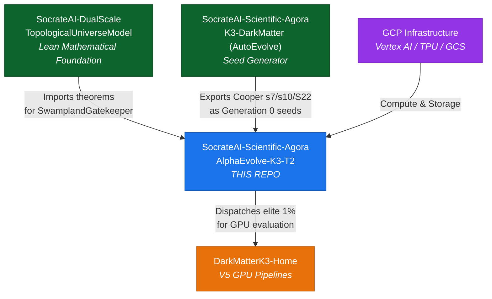

# SocrateAI-Scientific-Agora-AlphaEvolve-K3-T2 — Master Specification v2.0

> **Version**: 2.0.0  
> **Branch**: `feature/gcp-alpha-antigravity`  
> **Status**: SPECIFICATION — PHASE 1 COMPLETE, PHASE 2 READY  
> **Last Updated**: 2026-07-28  
> **Supersedes**: v1.0.0 (Gemini Low-Tier Plan)

---

## 1. Executive Summary

This specification defines the **Dual-Scale K3×T² Neuro-Symbolic Evolution Hub** — a dedicated repository (`SocrateAI-Scientific-Agora-AlphaEvolve-K3-T2`) that bridges formal F-theory verification (Lean 4), multi-objective geometric evolution (AlphaEvolve / NSGA-II), and empirical validation (GPU-based astrophysics pipelines).

The system automates the discovery of optimal K3×T² moduli via a **3-Tier Multi-Fidelity Pipeline** that culls 99% of candidates through fast surrogate evaluation and symbolic proof-checking before committing expensive GPU resources to empirical validation.

### 1.1 Key Goals

| Goal | Description |
|---|---|
| **Pareto-Optimized Evolution** | Automate K3×T² moduli discovery using NSGA-II to balance empirical fit with theoretical consistency |
| **Symbolic Gatekeeping** | Lean 4 as automated theorem-proving Oracle to filter Swampland-violating candidates |
| **Seamless Interoperability** | Central orchestrator connecting DualScaleTopologicalUniverseModel and DarkMatterK3 GPU repos |
| **Falsifiable Astrophysics** | Generate testable predictions for scalar monopole frequencies (PTA) and dynamic $S_8$ gradients (Euclid) |

### 1.2 Scope of This Document

- Full architecture specification for the upgraded Stream 5 repository
- Gap analysis between current PoC (Phase 1) and target architecture (Phase 2+)
- Cross-repository integration contracts
- Implementation roadmap across 4 phases (12 months)

---

## 2. Architecture: 3-Tier Neuro-Symbolic Engine

### 2.1 Pipeline Diagram

```
┌─────────────────────────────────────────────────────────────────────────────┐
│                        T0 DIRECTIVE / CRON TRIGGER                          │
└───────────────────────────────┬─────────────────────────────────────────────┘
                                │
                                ▼
┌─────────────────────────────────────────────────────────────────────────────┐
│              T1 COORDINATOR (SocrateAICoordinator)                          │
│    Gemini Tiered Model Router  │  Cost Tracker  │  Escalation Protocol      │
└───────────────────────────────┬─────────────────────────────────────────────┘
                                │
         ┌──────────────────────┼──────────────────────┐
         ▼                      ▼                      ▼
┌─────────────────┐  ┌─────────────────────┐  ┌─────────────────────┐
│  TIER 1          │  │  TIER 2              │  │  TIER 3              │
│  Neural Surrogate│  │  Symbolic Gatekeeper │  │  Empirical Ground    │
│  (Milliseconds)  │  │  (Seconds)           │  │  Truth (Min/Hours)   │
│                  │  │                      │  │                      │
│ • JAX mutations  │  │ • Lean 4 RPC Server  │  │ • SDSS DR17 align   │
│ • NSGA-II select │  │ • Swampland verify   │  │ • Euclid S_8 match  │
│ • 90% cull       │  │ • F-theory fibration │  │ • PTA monopole eval │
│ • Surrogate pred │  │ • Hard pass/fail     │  │ • DarkMatterK3 GPU  │
└────────┬─────────┘  └──────────┬───────────┘  └──────────┬───────────┘
         │ 10% survive           │ ~1% survive             │ Elite results
         ▼                      ▼                          ▼
┌─────────────────────────────────────────────────────────────────────────────┐
│                    PARETO FRONTIER (NSGA-II)                                 │
│  Objective A: Maximize χ² empirical fit (S_8, PTA, SDSS Δ spikes)           │
│  Objective B: Minimize Picard-Fuchs complexity (ODE stability)              │
│  Filter: Lean 4 Swampland pass/fail (Boolean constraint)                   │
└─────────────────────────────────────────────────────────────────────────────┘
```

### 2.2 Tier Descriptions

| Tier | Engine | Latency | Cull Rate | Purpose |
|---|---|---|---|---|
| **T1** | Neural Surrogate + JAX | ~5ms / candidate | 90% | Fast pre-screening via ML-predicted fitness |
| **T2** | Lean 4 RPC Oracle | ~2s / candidate | ~90% of survivors | Formal Swampland / F-theory verification |
| **T3** | V5 GPU Pipeline (DarkMatterK3) | ~10min / candidate | Final ranking | Full SDSS/Euclid/PTA empirical match |

---

## 3. Target Repository Structure (v2.0)

```
SocrateAI-Scientific-Agora-AlphaEvolve-K3-T2/
│
├── README.md                          
├── LICENSE                            
├── CITATION.cff                       
├── pyproject.toml                     # Python dependencies & build config
├── Dockerfile                         # Unified Lean 4 + Python/CUDA environment
├── .dvc/                              # Data Version Control for SDSS/Euclid catalogs
│
├── .github/workflows/                 # CI/CD Automation
│   ├── lean_proof_checks.yml          # Auto-verifies Lean 4 compilation on push
│   └── python_evolution_tests.yml     # Pytest suite & surrogate model tests
│
├── configs/                           # Hydra Configuration (YAML)
│   ├── evolution_nsga2.yaml           # Mutation rates, crossover, population sizes
│   ├── threshold_bounds.yaml          # GD-1 and Swampland constraint limits
│   └── gemini_model_config.yaml       # Gemini tiered model routing (from Phase 1)
│
├── data/                              # Managed by DVC (git-ignored)
│   ├── raw_observational/             # SDSS DR17, Euclid, PTA catalogs
│   └── processed_tensors/             # Cleaned tensors for GPU alignment
│
├── lean_oracle/                       # Isolated Lean 4 Formal Environment
│   ├── lakefile.lean                  # Lean package configuration
│   ├── SwamplandGatekeeper.lean       # F-Theory UV completeness & dS conjecture
│   ├── FTheoryFibration.lean          # Kodaira classification evaluation
│   └── rpc_server.lean               # JSON-RPC endpoint for Python queries
│
├── src/                               # High-Speed Python Core
│   ├── alpha_evolve/                  # Evolution Engine
│   │   ├── optimizers.py              # NSGA-II (Pareto) + CMA-ES (T² moduli)
│   │   ├── genetic_operators.py       # Tensor-based mutation & crossover
│   │   └── neural_surrogate.py        # ML surrogate predicting empirical fitness
│   │
│   ├── validation/                    # Empirical Pipeline Triggers
│   │   ├── sdss_euclid_eval.py        # Maps geometries to S_8 and κ-maps
│   │   └── pta_jwst_eval.py           # Scalar monopole oscillation evaluation
│   │
│   ├── integration/                   # Cross-Repo Adapters
│   │   ├── lean_client.py             # Python JSON-RPC wrapper for Lean 4
│   │   ├── autoevolve_ingest.py       # Imports Cooper s7/s10/S22 as Gen 0 seeds
│   │   └── gpu_v5_dispatcher.py       # Dispatches to DarkMatterK3 GPU cluster
│   │
│   └── utils/                         
│       └── mlops_logger.py            # MLflow / W&B lineage tracking
│
├── tests/                             
│   ├── test_lean_bridge.py            
│   ├── test_mutations.py             
│   ├── test_optimizers.py            
│   ├── test_surrogate.py            
│   └── test_integration.py          
│
├── notebooks/                         
│   ├── 01_pareto_frontier_demo.ipynb  
│   └── 02_surrogate_training.ipynb   
│
└── scripts/                           
    ├── run_alpha_evolve.py            # Main entry point (multi-generational)
    └── dvc_fetch_data.sh              # Pulls astronomical data from GCS
```

---

## 4. Phase 1 Completion Status & Gap Analysis

### 4.1 What Phase 1 Delivered (COMPLETE ✅)

| Component | Status | Files |
|---|---|---|
| Gemini Tiered Model Config | ✅ | `config/gemini_model_config.yaml`, `core/config_loader.py` |
| Model Router (18 actions) | ✅ | `core/model_router.py` |
| Tier Classifier (regex) | ✅ | `core/tier_classifier.py` |
| Cost Tracker (thread-safe) | ✅ | `core/cost_tracker.py` |
| Escalation Protocol (circuit breaker) | ✅ | `core/escalation_protocol.py` |
| SocrateAI Coordinator (multi-model) | ✅ | `core/agent_kit_orchestrator.py` |
| AlphaEvolve Feedback Summarizer | ✅ | `pipeline/alphaevolve_search/feedback_summarizer.py` |
| TPU Dispatch Pre-Validator | ✅ | `pipeline/antigravity_compute/dispatch_pre_validator.py` |
| Stream 5 K3-T2 PoC Scaffold | ✅ | `Stream5_AlphaEvolve_K3_T2/` (all modules) |
| Unit Tests (42/42 passing) | ✅ | `tests/` |

### 4.2 Gap Analysis: Phase 1 → Phase 2

| Component | Current State | Target State (Phase 2) | Gap |
|---|---|---|---|
| **NSGA-II Optimizer** | No optimizer; simulated `best_loss *= 0.72` | Full NSGA-II with Pareto ranking, crowding distance | **NEW MODULE** |
| **CMA-ES for T² Moduli** | Missing | Covariance Matrix Adaptation for continuous T² parameter refinement | **NEW MODULE** |
| **Genetic Operators** | Missing | Tensor-based crossover, bounded mutation, polynomial mutation | **NEW MODULE** |
| **Neural Surrogate** | Missing | Pre-trained MLP predicting empirical fitness from geometry parameters | **NEW MODULE** |
| **Candidate Representation** | None | `K3T2Candidate` dataclass with Picard-Fuchs coefficients + T² moduli | **NEW** |
| **Fitness Evaluation** | Scalar Monge-Ampère MSE only | Multi-objective (empirical fit + complexity penalty) | **EXTEND** |
| **Generation 0 Seeds** | Random initialization | Ingest Cooper s7/s10/S22 from AutoEvolve repo | **NEW** |
| **MLOps Tracking** | Cost tracker only | W&B / MLflow experiment logging with Pareto front visualization | **NEW** |
| **Hydra Configs** | Single YAML | Hydra-managed `evolution_nsga2.yaml` + `threshold_bounds.yaml` | **EXTEND** |

---

## 5. Cross-Repository Integration Contracts

### 5.1 Repository Dependency Map



### 5.2 API Contracts

| Interface | Protocol | From → To | Data Format |
|---|---|---|---|
| Lean 4 Oracle Query | JSON-RPC over localhost | `lean_client.py` → `rpc_server.lean` | `{moduli: [...], hodge: {h11, h21}}` → `{valid: bool, proof_hash: str}` |
| Gen 0 Seed Ingest | Python import / GCS read | `autoevolve_ingest.py` → K3-DarkMatter repo | `List[K3T2Candidate]` with pre-validated configs |
| GPU Dispatch | REST API / gRPC | `gpu_v5_dispatcher.py` → DarkMatterK3 V5 | `K3T2Candidate` → `{chi2_sdss, s8_gradient, pta_freq}` |
| MLOps Logging | W&B / MLflow SDK | `mlops_logger.py` → W&B cloud / MLflow server | Pareto front metrics, generation lineage, loss curves |

---

## 6. Implementation Roadmap

### Phase 1: MLOps Infrastructure & Oracle Bridge — ✅ COMPLETE

- Gemini tiered model routing system
- Cost tracking, escalation protocol, circuit breaker
- Stream 5 K3-T2 scaffold with basic PoC
- 42/42 unit tests passing

### Phase 2: Surrogate Training & MOEA Engine — **CURRENT PHASE** 🔵

> Detailed plan: [`specs/phase2_implementation_plan.md`](file:///home/xavkal/.gemini/antigravity-ide/scratch/socrateai/specs/phase2_implementation_plan.md)

- NSGA-II multi-objective optimizer
- CMA-ES continuous parameter refinement for T² moduli
- Neural surrogate model for fast fitness prediction
- K3T2Candidate dataclass & genetic operators
- Generation 0 seed ingestion (Cooper s7/s10/S22)
- W&B / MLflow experiment tracking integration
- Hydra configuration management

### Phase 3: Deep Evolution & Empirical Integration (Months 5–7)

- Lean 4 RPC Server & SwamplandGatekeeper implementation
- `lean_client.py` Python-to-Lean bridge
- Link surviving populations to V5 GPU pipeline
- Run 10,000-generation distributed evolution
- DVC pipeline for astronomical dataset management

### Phase 4: Falsification & Publication (Months 8–12)

- Extract optimal K3×T² geometry from Pareto frontier
- Generate hard, falsifiable predictions:
  - Scalar monopole frequencies (PTA)
  - JWST high-z anomalies
  - Dynamic $S_8$ gradients (Euclid)
- Open-source release with reproducibility guidelines
- Target: Nature Astronomy, PRL, or equivalent

---

## 7. Multi-Objective Fitness Evaluation Schema

### 7.1 Fitness Vector Definition

Each `K3T2Candidate` is evaluated on a **Pareto Frontier** with the following objectives:

| Dimension | Type | Description | Weight |
|---|---|---|---|
| **Filter** | Boolean constraint | Lean 4 Swampland pass/fail | Hard gate (∞ penalty on fail) |
| **Objective A** | Maximize | $\chi^2$ alignment with SDSS $\Delta$ spikes, Euclid $S_8$, PTA monopoles | — |
| **Objective B** | Minimize | Picard-Fuchs coefficient complexity (ODE stability, Chameleon viability) | — |

### 7.2 Candidate Representation

```python
@dataclass
class K3T2Candidate:
    """Represents a single K3×T² geometry configuration in the evolutionary search."""
    # K3 Surface Parameters
    picard_fuchs_coefficients: np.ndarray   # shape: (order,) — ODE coefficients
    hodge_numbers: Dict[str, int]           # {h11: int, h21: int, h22: int}
    kodaira_fiber_type: str                 # e.g., "I_1", "II", "IV*"
    
    # T² Torus Moduli
    complex_structure_tau: complex           # τ = τ₁ + iτ₂ (τ₂ > 0)
    kahler_modulus_rho: complex             # ρ (area/shape)
    
    # Fitness Scores (populated after evaluation)
    surrogate_fitness: Optional[float] = None
    lean_swampland_valid: Optional[bool] = None
    empirical_chi2: Optional[float] = None
    complexity_score: Optional[float] = None
    
    # Lineage Tracking
    generation: int = 0
    parent_ids: List[str] = field(default_factory=list)
    candidate_id: str = field(default_factory=lambda: str(uuid4()))
```

---

## 8. Risk Register

| Risk | Impact | Likelihood | Mitigation |
|---|---|---|---|
| Surrogate model drifts from true fitness landscape | High | Medium | Periodic retraining on Tier 3 ground-truth; active learning acquisition |
| Lean 4 compilation times bottleneck Tier 2 throughput | High | Medium | Batch proof queries; cache verified moduli ranges |
| NSGA-II premature convergence on local Pareto optima | Medium | Medium | Island-model parallelism; periodic random injection |
| Cooper seed configurations over-bias Generation 0 | Medium | Low | Mix seeds with random perturbations; track lineage diversity |
| GCP compute costs exceed budget during large evolution runs | High | Medium | Cost tracker circuit breaker; Gemini Flash for orchestration |
| DarkMatterK3 GPU API changes break dispatcher | Medium | Low | Versioned API contracts; integration test on each commit |

---

## 9. Acceptance Criteria (Full System)

| Metric | Phase 2 Target | Final Target |
|---|---|---|
| Unit test pass rate | 100% (60+ tests) | 100% (120+ tests) |
| NSGA-II convergence on test problem | Pareto front within 5% of known optimum | — |
| Surrogate prediction accuracy | R² ≥ 0.85 on validation set | R² ≥ 0.95 |
| Tier 1 throughput | ≥ 10,000 candidates/sec | ≥ 100,000 candidates/sec |
| Tier 2 throughput | ≥ 100 proofs/min | ≥ 500 proofs/min |
| End-to-end pipeline time (100 generations) | < 30 min (local) | < 5 min (TPU cluster) |
| Monthly GCP cost (Flash-routed orchestration) | < $50 | < $100 |
