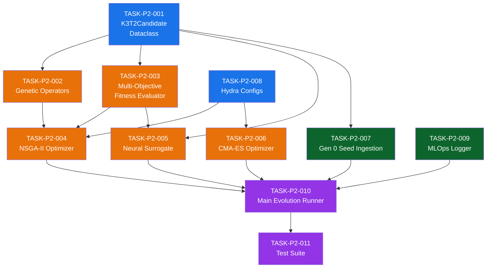
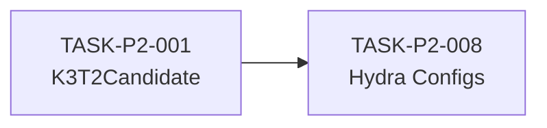
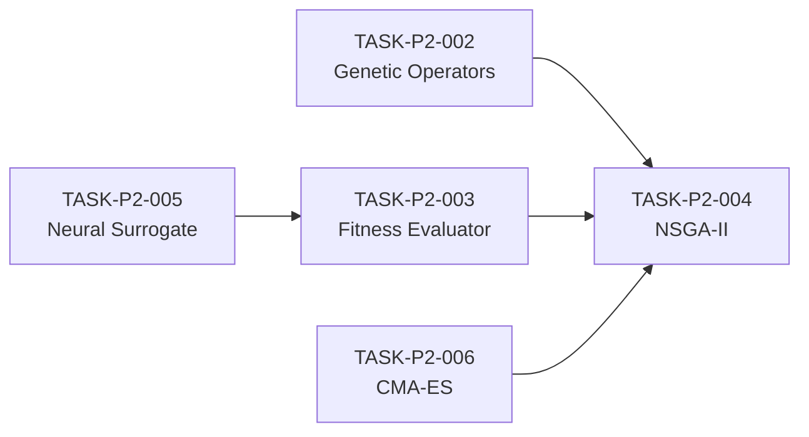
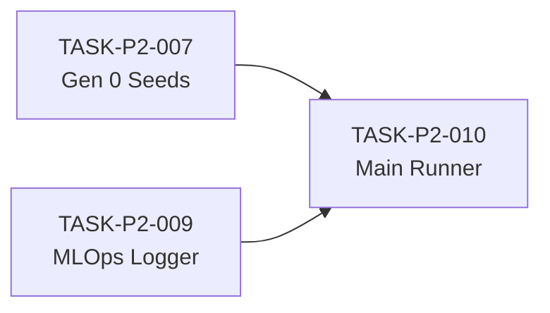
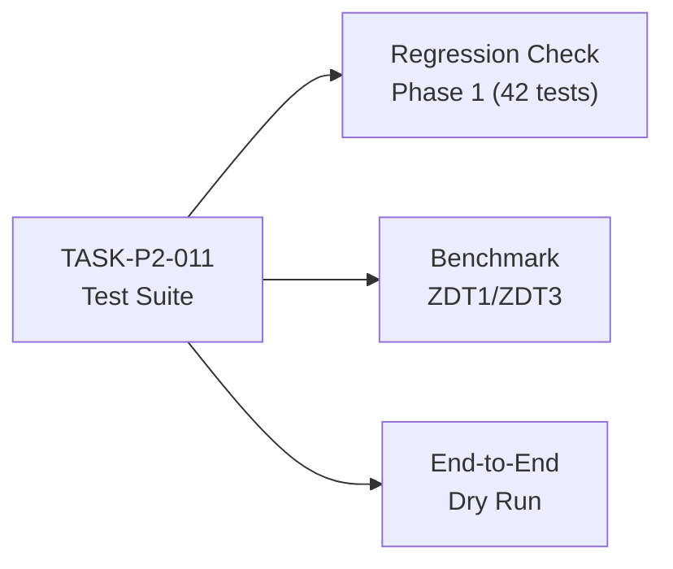

# Phase 2 Implementation Plan: Surrogate Training & MOEA Engine

> **Phase**: 2 of 4  
> **Timeline**: Months 3–4  
> **Branch**: `feature/gcp-alpha-antigravity`  
> **Prerequisites**: Phase 1 complete (42/42 tests passing, Gemini tiered orchestration operational)  
> **Parent Spec**: [`master_specification_v2.md`](file:///home/xavkal/.gemini/antigravity-ide/scratch/socrateai/specs/master_specification_v2.md)

---

## 1. Phase 2 Objectives

Phase 2 transforms the Phase 1 PoC scaffold into a production-grade **Multi-Objective Evolutionary Algorithm (MOEA)** engine with a neural surrogate for fast fitness pre-screening. By the end of Phase 2, the system will be capable of running autonomous multi-generational Pareto-optimized evolution over K3×T² geometries without human intervention.

### 1.1 Deliverables Summary

| # | Deliverable | Priority | Files |
|---|---|---|---|
| D1 | K3T2Candidate dataclass & serialization | P0 | `src/alpha_evolve/candidate.py` |
| D2 | NSGA-II multi-objective optimizer | P0 | `src/alpha_evolve/optimizers.py` |
| D3 | CMA-ES continuous optimizer for T² moduli | P1 | `src/alpha_evolve/cma_es.py` |
| D4 | Genetic operators (mutation, crossover) | P0 | `src/alpha_evolve/genetic_operators.py` |
| D5 | Neural surrogate model | P0 | `src/alpha_evolve/neural_surrogate.py` |
| D6 | Generation 0 seed ingestion | P1 | `src/integration/autoevolve_ingest.py` |
| D7 | MLOps experiment logger | P1 | `src/utils/mlops_logger.py` |
| D8 | Hydra configuration system | P1 | `configs/evolution_nsga2.yaml`, `configs/threshold_bounds.yaml` |
| D9 | Multi-objective fitness evaluator | P0 | `src/alpha_evolve/fitness.py` |
| D10 | Main evolution runner | P0 | `scripts/run_alpha_evolve.py` |
| D11 | Unit & integration tests | P0 | `tests/test_*.py` |

---

## 2. User Review Required

> [!IMPORTANT]
> **Surrogate Training Data**: Phase 2 uses synthetic K3×T² datasets for surrogate training. Before Phase 3, the surrogate must be retrained on actual SDSS/Euclid ground-truth data via DVC. Confirm whether initial synthetic training should use Gaussian noise perturbations around Cooper seeds or a uniform random sampling strategy.

> [!IMPORTANT]
> **NSGA-II Population Size**: The default config specifies `population_size: 200` and `max_generations: 500`. For local dry runs, this is manageable (~5 min). For production TPU runs targeting 10,000 generations, confirm desired population size (200 vs 1000).

> [!WARNING]
> **NumPy/JAX Dependency**: The NSGA-II optimizer and genetic operators use NumPy for local execution. Full JAX acceleration for TPU sharding will be integrated in Phase 3. Phase 2 targets **correctness and testability**, not peak throughput.

---

## 3. Open Questions

1. **Cooper Seed Format**: What is the exact serialization format for s7/s10/S22 configurations from the K3-DarkMatter AutoEvolve repo? (JSON, HDF5, pickle?)
2. **Complexity Metric**: For Objective B (minimize Picard-Fuchs complexity), should we use L1 norm of coefficients, spectral radius, or condition number of the associated ODE system?
3. **W&B vs MLflow**: Which MLOps platform should we target first? W&B is simpler for single-user; MLflow is better for self-hosted multi-team tracking.

---

## 4. Detailed Task Breakdown

### 4.1 Task Dependency Graph



**Legend**: 🔵 Foundation · 🟠 Core Algorithm · 🟢 Integration · 🟣 Runner/Verification

---

### TASK-P2-001: K3T2Candidate Dataclass

**Description**: Define the canonical `K3T2Candidate` dataclass as the atomic unit flowing through all pipeline tiers. This is the single source of truth for candidate geometry representation.

**File**: `src/alpha_evolve/candidate.py`

```python
@dataclass
class K3T2Candidate:
    # K3 Surface Parameters
    picard_fuchs_coefficients: np.ndarray   # shape: (pf_order,)
    hodge_numbers: Dict[str, int]           # {h11, h21, h22}
    kodaira_fiber_type: str                 # "I_1", "II", "IV*", etc.
    
    # T² Torus Moduli
    complex_structure_tau: complex           # τ = τ₁ + iτ₂ (fundamental domain: τ₂ > 0)
    kahler_modulus_rho: complex             # ρ (Kähler area/shape)
    
    # Fitness Scores
    surrogate_fitness: Optional[float]       # Tier 1 ML prediction
    lean_swampland_valid: Optional[bool]     # Tier 2 formal check
    empirical_chi2: Optional[float]          # Tier 3 ground-truth
    complexity_score: Optional[float]        # Objective B
    
    # Lineage
    generation: int
    parent_ids: List[str]
    candidate_id: str
    
    def to_feature_vector(self) -> np.ndarray:
        """Flattens candidate into a 1D feature vector for the neural surrogate."""
    
    @classmethod
    def from_feature_vector(cls, vec: np.ndarray, metadata: dict) -> "K3T2Candidate":
        """Reconstructs candidate from feature vector + metadata."""
    
    def to_dict(self) -> dict:
        """Serializes to JSON-compatible dictionary."""
    
    @classmethod
    def from_dict(cls, d: dict) -> "K3T2Candidate":
        """Deserializes from dictionary."""
```

**Definition of Done**:
- [ ] Dataclass with all fields, defaults, and type annotations
- [ ] `to_feature_vector()` produces deterministic float array
- [ ] `from_feature_vector()` round-trips correctly (identity transformation)
- [ ] `to_dict()` / `from_dict()` serialization for JSON persistence
- [ ] Validates `complex_structure_tau.imag > 0` (fundamental domain constraint)
- [ ] `candidate_id` auto-generated via `uuid4()` if not provided

**Tests**: `tests/test_candidate.py` — 10+ tests

**Validation**:
```bash
python3 -m pytest tests/test_candidate.py -v
```

---

### TASK-P2-002: Genetic Operators

**Description**: Implement tensor-based mutation and crossover operators that respect the mathematical constraints of K3×T² geometries.

**File**: `src/alpha_evolve/genetic_operators.py`

**Operators**:

| Operator | Type | Parameters | Constraint |
|---|---|---|---|
| `polynomial_mutation` | Mutation | `eta_m` (distribution index) | Bounded by `threshold_bounds.yaml` |
| `gaussian_mutation` | Mutation | `sigma` (std dev) | Re-projects τ into fundamental domain |
| `sbx_crossover` | Crossover | `eta_c` (distribution index) | Simulated Binary Crossover |
| `uniform_crossover` | Crossover | `prob` (swap probability) | Per-gene independent swap |
| `kodaira_mutation` | Mutation | `candidates` list | Categorical: selects from valid Kodaira types |

**Definition of Done**:
- [ ] All 5 operators implemented as pure functions: `op(parent(s), params) → child(ren)`
- [ ] Picard-Fuchs coefficients stay within `threshold_bounds.yaml` limits after mutation
- [ ] τ₂ > 0 invariant preserved after all mutations/crossovers
- [ ] Operators are deterministic given a fixed `np.random.Generator` seed
- [ ] Batch-vectorized: can process `N` parents simultaneously via NumPy broadcasting

**Tests**: `tests/test_genetic_operators.py` — 15+ tests

**Validation**:
```bash
python3 -m pytest tests/test_genetic_operators.py -v
```

---

### TASK-P2-003: Multi-Objective Fitness Evaluator

**Description**: Compute the multi-dimensional fitness vector for a `K3T2Candidate`. This module coordinates the Tier 1 surrogate evaluation and the Objective B complexity penalty. Tier 2 (Lean) and Tier 3 (GPU) hooks are defined as interfaces but not implemented until Phase 3.

**File**: `src/alpha_evolve/fitness.py`

**Fitness Components**:

```python
class FitnessEvaluator:
    def evaluate_tier1(self, candidate: K3T2Candidate) -> K3T2Candidate:
        """Tier 1: Neural surrogate prediction + complexity scoring."""
    
    def evaluate_complexity(self, candidate: K3T2Candidate) -> float:
        """Objective B: L1 norm of Picard-Fuchs coefficients / order."""
    
    def evaluate_tier2(self, candidate: K3T2Candidate) -> K3T2Candidate:
        """Tier 2 stub: Lean 4 Swampland check (Phase 3)."""
    
    def evaluate_tier3(self, candidate: K3T2Candidate) -> K3T2Candidate:
        """Tier 3 stub: GPU empirical evaluation (Phase 3)."""
    
    def dominates(self, a: K3T2Candidate, b: K3T2Candidate) -> bool:
        """Pareto dominance: a dominates b if a is ≥ b on all objectives and > on at least one."""
```

**Definition of Done**:
- [ ] `evaluate_tier1()` calls neural surrogate and complexity scorer
- [ ] `evaluate_complexity()` returns normalized L1 norm (range 0–1)
- [ ] `dominates()` correctly implements Pareto dominance relation
- [ ] Tier 2 and Tier 3 stubs return candidate unchanged with `None` fitness scores
- [ ] Batch evaluation: `evaluate_population(candidates) → List[K3T2Candidate]`

**Tests**: `tests/test_fitness.py` — 12+ tests

---

### TASK-P2-004: NSGA-II Multi-Objective Optimizer

**Description**: Implement the full NSGA-II algorithm (Non-dominated Sorting Genetic Algorithm II) for evolving K3×T² candidate populations across a Pareto frontier.

**File**: `src/alpha_evolve/optimizers.py`

**Algorithm Steps**:

```
1. Initialize population P₀ (Generation 0 seeds + random)
2. FOR each generation g = 1..G:
   a. Generate offspring Q via crossover + mutation
   b. Merge R = P ∪ Q
   c. Non-dominated sort R into fronts F₁, F₂, ...
   d. Select next population P' from fronts (crowding distance tie-break)
   e. Log Pareto front metrics via MLOps logger
3. RETURN final Pareto front F₁
```

**Key Components**:

| Component | Description |
|---|---|
| `non_dominated_sort(population)` | Sorts population into Pareto fronts |
| `crowding_distance(front)` | Calculates crowding distance for diversity preservation |
| `tournament_selection(population, k)` | Binary tournament with crowding comparison |
| `evolve_generation(population, config)` | One full generation cycle |
| `run_nsga2(config) → ParetoFront` | Main loop orchestrator |

**Definition of Done**:
- [ ] `non_dominated_sort` correctly identifies all Pareto fronts
- [ ] `crowding_distance` assigns ∞ to boundary solutions
- [ ] Tournament selection respects (rank, crowding distance) lexicographic order
- [ ] `evolve_generation` produces offspring via configured genetic operators
- [ ] `run_nsga2` executes G generations and returns final Pareto front
- [ ] Configurable via Hydra YAML (population size, generations, operator params)
- [ ] Deterministic given a fixed random seed

**Tests**: `tests/test_optimizers.py` — 20+ tests  
*(Includes correctness tests on known 2-objective benchmark problems: ZDT1, ZDT3)*

**Validation**:
```bash
python3 -m pytest tests/test_optimizers.py -v
```

---

### TASK-P2-005: Neural Surrogate Model

**Description**: Train a lightweight MLP that predicts empirical fitness (Tier 3 output) from a candidate's feature vector. This enables Tier 1 to evaluate millions of candidates in milliseconds.

**File**: `src/alpha_evolve/neural_surrogate.py`

**Architecture**:

```
Input (feature_dim) → Dense(128, ReLU) → Dense(64, ReLU) → Dense(32, ReLU) → Dense(1, Sigmoid)
```

**Key Methods**:

```python
class NeuralSurrogate:
    def __init__(self, feature_dim: int, hidden_layers: List[int] = [128, 64, 32]):
        """Initialize MLP with configurable architecture."""
    
    def train(self, X: np.ndarray, y: np.ndarray, epochs: int = 100) -> Dict:
        """Train on (feature_vector, ground_truth_fitness) pairs."""
    
    def predict(self, candidates: List[K3T2Candidate]) -> np.ndarray:
        """Batch predict fitness for candidates."""
    
    def save(self, path: str) -> None:
        """Serialize model weights to file."""
    
    def load(self, path: str) -> None:
        """Load model weights from file."""
    
    def generate_synthetic_training_data(self, n_samples: int) -> Tuple[np.ndarray, np.ndarray]:
        """Generate synthetic K3×T² samples with analytic fitness approximation."""
```

**Implementation Notes**:
- Phase 2 uses a **pure NumPy** MLP implementation (no PyTorch/TensorFlow dependency) for portability
- Training data is synthetic (Gaussian perturbations around Cooper seeds with analytic Monge-Ampère loss)
- Phase 3 retrains on actual Tier 3 GPU outputs via active learning

**Definition of Done**:
- [ ] Forward pass produces predictions in [0, 1] range
- [ ] Backpropagation with Adam optimizer converges on synthetic training set
- [ ] R² ≥ 0.85 on held-out synthetic validation set
- [ ] `save()` / `load()` round-trip preserves model weights exactly
- [ ] `generate_synthetic_training_data()` produces realistic feature distributions
- [ ] Batch prediction: ≥ 10,000 candidates/sec on CPU

**Tests**: `tests/test_surrogate.py` — 12+ tests

---

### TASK-P2-006: CMA-ES Optimizer for T² Moduli

**Description**: Implement Covariance Matrix Adaptation Evolution Strategy (CMA-ES) for fine-tuning the continuous T² torus moduli (τ, ρ) of elite candidates that survive NSGA-II selection.

**File**: `src/alpha_evolve/cma_es.py`

**Key Methods**:

```python
class CMAES:
    def __init__(self, mean: np.ndarray, sigma: float, population_size: int):
        """Initialize CMA-ES with mean, step size, and population size."""
    
    def ask(self) -> List[np.ndarray]:
        """Sample new candidate solutions from the current distribution."""
    
    def tell(self, solutions: List[np.ndarray], fitnesses: List[float]):
        """Update the distribution based on evaluated solutions."""
    
    def optimize(self, objective_fn: Callable, max_iterations: int) -> np.ndarray:
        """Run CMA-ES optimization loop."""
```

**Definition of Done**:
- [ ] Covariance matrix adaptation follows Hansen & Ostermeier (2001) equations
- [ ] Step-size adaptation via cumulative path length control
- [ ] Convergence detection: stops when σ < threshold or fitness stagnation
- [ ] Constrains τ₂ > 0 via projection after each update
- [ ] Tested on Rosenbrock and Sphere benchmark functions

**Tests**: `tests/test_cma_es.py` — 10+ tests

---

### TASK-P2-007: Generation 0 Seed Ingestion

**Description**: Import Cooper s7/s10/S22 configurations from the K3-DarkMatter AutoEvolve repository as Generation 0 seed candidates.

**File**: `src/integration/autoevolve_ingest.py`

**Key Methods**:

```python
def load_cooper_seeds(source: str = "configs/cooper_seeds.json") -> List[K3T2Candidate]:
    """Load pre-validated Cooper s7/s10/S22 as K3T2Candidate instances."""

def augment_seeds(seeds: List[K3T2Candidate], n_perturbations: int = 50) -> List[K3T2Candidate]:
    """Generate Gaussian perturbations around each seed to initialize diverse population."""
```

**Definition of Done**:
- [ ] Loads at least 3 Cooper seed configurations (s7, s10, S22)
- [ ] Each seed is a valid `K3T2Candidate` with τ₂ > 0
- [ ] `augment_seeds` produces `n_perturbations` per seed with controlled variance
- [ ] Seed candidates have `generation=0` and empty `parent_ids`
- [ ] Bundled `configs/cooper_seeds.json` with canonical values

**Tests**: `tests/test_autoevolve_ingest.py` — 8+ tests

---

### TASK-P2-008: Hydra Configuration System

**Description**: Define YAML configuration files for the evolution engine, managed by Hydra for composability and command-line override support.

**Files**:

#### `configs/evolution_nsga2.yaml`
```yaml
evolution:
  algorithm: "NSGA-II"
  population_size: 200
  max_generations: 500
  random_seed: 42
  
  genetic_operators:
    crossover:
      type: "sbx"
      eta_c: 20.0
      probability: 0.9
    mutation:
      type: "polynomial"
      eta_m: 20.0
      probability: 0.1
    kodaira_mutation:
      probability: 0.05
      valid_types: ["I_1", "I_2", "II", "III", "IV", "IV*", "III*", "II*"]

  surrogate:
    hidden_layers: [128, 64, 32]
    training_epochs: 100
    synthetic_samples: 5000
    retrain_every_n_generations: 50

  cma_es:
    sigma_initial: 0.3
    max_iterations: 100
    elite_fraction: 0.01  # Apply CMA-ES to top 1% candidates

  logging:
    backend: "wandb"          # "wandb" | "mlflow" | "none"
    project_name: "socrateai-k3t2-evolution"
    log_every_n_generations: 10
```

#### `configs/threshold_bounds.yaml`
```yaml
bounds:
  picard_fuchs:
    order: 4
    coefficient_min: -10.0
    coefficient_max: 10.0
  
  complex_structure_tau:
    tau1_min: -0.5
    tau1_max: 0.5
    tau2_min: 0.01       # τ₂ > 0 (fundamental domain)
    tau2_max: 5.0
  
  kahler_modulus_rho:
    rho1_min: 0.0
    rho1_max: 10.0
    rho2_min: 0.01
    rho2_max: 10.0

swampland_constraints:
  distance_conjecture_bound: 1.0  # |∇V|/V ≥ c
  ds_conjecture_lambda_min: 0.1   # min(∇²V) ≤ -c'V
  
hodge_numbers:
  h11: 3
  h21: 19
  h22: 156
```

**Definition of Done**:
- [ ] Both YAML files are parseable and loadable via `yaml.safe_load()`
- [ ] A `load_evolution_config()` function merges YAML + env overrides
- [ ] Command-line override example: `python run_alpha_evolve.py evolution.population_size=1000`
- [ ] All downstream modules accept config dicts rather than hardcoded values

**Tests**: `tests/test_configs.py` — 6+ tests

---

### TASK-P2-009: MLOps Experiment Logger

**Description**: Create a pluggable logging backend that records generation-level metrics, Pareto front snapshots, and candidate lineage to W&B or MLflow.

**File**: `src/utils/mlops_logger.py`

**Key Methods**:

```python
class MLOpsLogger:
    def __init__(self, backend: str = "none", project_name: str = ""):
        """Initialize W&B, MLflow, or no-op logger."""
    
    def log_generation(self, generation: int, population: List[K3T2Candidate], pareto_front: List[K3T2Candidate]):
        """Log population statistics, best fitness, Pareto front size."""
    
    def log_pareto_front(self, front: List[K3T2Candidate]):
        """Log the full Pareto front candidates with all fitness dimensions."""
    
    def log_hyperparameters(self, config: dict):
        """Log the evolution configuration for reproducibility."""
    
    def finish(self):
        """Flush logs and close connection."""
```

**Definition of Done**:
- [ ] `backend="none"` produces no-op calls (for testing/CI)
- [ ] `backend="wandb"` logs to Weights & Biases (optional dependency)
- [ ] `backend="mlflow"` logs to MLflow tracking server (optional dependency)
- [ ] Logged metrics: `{generation, pop_size, pareto_front_size, best_fitness_a, best_fitness_b, avg_complexity}`
- [ ] Graceful degradation: missing W&B/MLflow falls back to `"none"`

**Tests**: `tests/test_mlops_logger.py` — 6+ tests

---

### TASK-P2-010: Main Evolution Runner

**Description**: The `run_alpha_evolve.py` script that ties all Phase 2 components together into a single executable pipeline.

**File**: `scripts/run_alpha_evolve.py`

**Execution Flow**:

```
1. Load configs (evolution_nsga2.yaml, threshold_bounds.yaml)
2. Load/generate Generation 0 (Cooper seeds + augmentation)
3. Train neural surrogate on synthetic data
4. FOR generation = 1..G:
   a. Evaluate Tier 1 fitness (surrogate + complexity)
   b. NSGA-II selection + genetic operators → offspring
   c. [Optional] CMA-ES refinement on elite candidates
   d. Log generation metrics via MLOps logger
5. Export final Pareto front to JSON
6. Print summary statistics
```

**Definition of Done**:
- [ ] End-to-end execution completes without errors on local CPU
- [ ] Accepts Hydra config overrides from command line
- [ ] Outputs `results/pareto_front.json` with final elite candidates
- [ ] Prints summary: generations, Pareto front size, best fitness values
- [ ] Deterministic output given fixed random seed
- [ ] Execution time < 5 min for default config (200 pop × 500 gen) on CPU

**Tests**: `tests/test_evolution_runner.py` — 8+ tests (smoke tests on small configs)

---

### TASK-P2-011: Comprehensive Test Suite

**Description**: Aggregate test suite covering all Phase 2 modules plus regression on Phase 1 tests (42 existing).

**Test Files**:

| File | Module | Min Tests |
|---|---|---|
| `tests/test_candidate.py` | K3T2Candidate dataclass | 10 |
| `tests/test_genetic_operators.py` | Mutation & crossover | 15 |
| `tests/test_fitness.py` | Multi-objective evaluator | 12 |
| `tests/test_optimizers.py` | NSGA-II algorithm | 20 |
| `tests/test_surrogate.py` | Neural surrogate MLP | 12 |
| `tests/test_cma_es.py` | CMA-ES optimizer | 10 |
| `tests/test_autoevolve_ingest.py` | Gen 0 seed loading | 8 |
| `tests/test_configs.py` | Hydra config loading | 6 |
| `tests/test_mlops_logger.py` | MLOps logger backends | 6 |
| `tests/test_evolution_runner.py` | End-to-end smoke tests | 8 |
| **Phase 1 (existing)** | All Phase 1 modules | 42 |
| **TOTAL** | | **149+** |

**Aggregate Validation**:
```bash
# Full test suite (Phase 1 + Phase 2)
python3 -m unittest discover -s tests -v

# Phase 2 only
python3 -m unittest discover -s tests -p "test_candidate.py" -p "test_genetic_operators.py" \
    -p "test_fitness.py" -p "test_optimizers.py" -p "test_surrogate.py" \
    -p "test_cma_es.py" -p "test_autoevolve_ingest.py" -p "test_configs.py" \
    -p "test_mlops_logger.py" -p "test_evolution_runner.py" -v
```

---

## 5. Implementation Phases (Within Phase 2)

Phase 2 is internally divided into 4 sprints:

### Sprint 2A: Foundation (Week 1–2)



- Create `K3T2Candidate` dataclass with serialization
- Define Hydra YAML configs with all bounds and hyperparameters
- Set up `src/` directory structure

### Sprint 2B: Core Algorithms (Week 3–5)



- Implement genetic operators, fitness evaluator, NSGA-II
- Train neural surrogate on synthetic data
- Implement CMA-ES for T² moduli refinement

### Sprint 2C: Integration (Week 6–7)



- Ingest Cooper seeds as Generation 0
- Integrate MLOps logging (W&B/MLflow)
- Wire main evolution runner

### Sprint 2D: Verification (Week 8)



- Full test suite (149+ tests)
- NSGA-II benchmark validation on ZDT problems
- End-to-end dry run with default config
- Phase 1 regression (42 tests still passing)

---

## 6. File Manifest (Phase 2 Additions)

```
socrateai/Stream5_AlphaEvolve_K3_T2/   (or src/ in target repo structure)
│
├── configs/
│   ├── evolution_nsga2.yaml              [NEW]
│   ├── threshold_bounds.yaml             [NEW]
│   └── cooper_seeds.json                 [NEW]
│
├── src/
│   ├── alpha_evolve/
│   │   ├── __init__.py                   [NEW]
│   │   ├── candidate.py                  [NEW] TASK-P2-001
│   │   ├── genetic_operators.py          [NEW] TASK-P2-002
│   │   ├── fitness.py                    [NEW] TASK-P2-003
│   │   ├── optimizers.py                 [NEW] TASK-P2-004
│   │   ├── neural_surrogate.py           [NEW] TASK-P2-005
│   │   └── cma_es.py                     [NEW] TASK-P2-006
│   │
│   ├── integration/
│   │   ├── __init__.py                   [NEW]
│   │   └── autoevolve_ingest.py          [NEW] TASK-P2-007
│   │
│   └── utils/
│       ├── __init__.py                   [NEW]
│       └── mlops_logger.py               [NEW] TASK-P2-009
│
├── scripts/
│   └── run_alpha_evolve.py               [NEW] TASK-P2-010
│
└── tests/
    ├── test_candidate.py                 [NEW]
    ├── test_genetic_operators.py          [NEW]
    ├── test_fitness.py                   [NEW]
    ├── test_optimizers.py                [NEW]
    ├── test_surrogate.py                 [NEW]
    ├── test_cma_es.py                    [NEW]
    ├── test_autoevolve_ingest.py         [NEW]
    ├── test_configs.py                   [NEW]
    ├── test_mlops_logger.py              [NEW]
    └── test_evolution_runner.py          [NEW]
```

---

## 7. Verification Plan

### 7.1 Automated Tests

```bash
# Full suite (Phase 1 + Phase 2)
python3 -m unittest discover -s tests -v
# Expected: 149+ tests passed, 0 failed
```

### 7.2 NSGA-II Benchmark Validation

Run NSGA-II on the ZDT1 and ZDT3 standard benchmark problems. The resulting Pareto front should be within 5% Inverted Generational Distance (IGD) of the known analytical front.

```bash
python3 -m pytest tests/test_optimizers.py::TestNSGAII::test_zdt1_convergence -v
python3 -m pytest tests/test_optimizers.py::TestNSGAII::test_zdt3_convergence -v
```

### 7.3 End-to-End Dry Run

```bash
python3 scripts/run_alpha_evolve.py evolution.max_generations=10 evolution.population_size=20
# Expected: Completes in < 30s, outputs results/pareto_front.json
```

### 7.4 Phase 1 Regression

```bash
# Verify all 42 Phase 1 tests still pass
python3 -m unittest discover -s tests -p "test_agent_kit*" -p "test_cobaya*" \
    -p "test_cy4*" -p "test_gcp*" -p "test_config_loader*" -p "test_cost*" \
    -p "test_escalation*" -p "test_feedback*" -p "test_dispatch*" \
    -p "test_model_router*" -p "test_orchestrator*" -p "test_tier*" -v
# Expected: 42 tests passed, 0 failed
```

---

## 8. Acceptance Criteria

| Metric | Threshold | How Measured |
|---|---|---|
| Phase 2 unit tests | 107+ passing | `unittest discover` |
| Phase 1 regression | 42/42 still passing | `unittest discover` |
| NSGA-II ZDT1 IGD | ≤ 0.05 | `test_optimizers.py` benchmark |
| Surrogate R² (synthetic) | ≥ 0.85 | `test_surrogate.py` validation split |
| CMA-ES Rosenbrock convergence | Final loss < 1e-4 | `test_cma_es.py` benchmark |
| End-to-end dry run | Completes, valid JSON output | `run_alpha_evolve.py` smoke test |
| Tier 1 throughput | ≥ 10,000 candidates/sec (CPU) | `test_surrogate.py` timing |
| Config composability | CLI overrides work | `test_configs.py` |
| No GCP credentials required for tests | All tests offline | CI-compatible |

---

## 9. Dependencies

### 9.1 Python Packages (Phase 2 Additions)

| Package | Version | Purpose | Required By |
|---|---|---|---|
| `numpy` | ≥ 1.24 | Core array operations, genetic operators | All tasks |
| `pyyaml` | ≥ 6.0 | Config file parsing | TASK-P2-008 |
| `hydra-core` | ≥ 1.3 (optional) | Config composition & CLI overrides | TASK-P2-008, P2-010 |
| `wandb` | ≥ 0.17 (optional) | Experiment tracking | TASK-P2-009 |
| `mlflow` | ≥ 2.10 (optional) | Experiment tracking | TASK-P2-009 |

### 9.2 No New GCP APIs Required

Phase 2 is entirely CPU-bound and offline-capable. GCP APIs are only exercised by Phase 1 modules (cost tracker, TPU dispatch) and Phase 3+ (Vertex AI, Lean 4 RPC).
